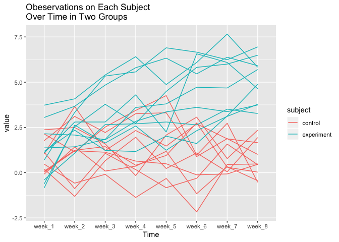
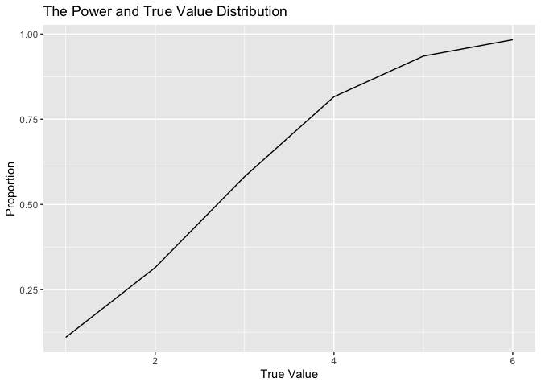

ss5929
================
Shuyi SHEN
11/2/2019

## Problem 1

``` r
library(tidyverse)
```

    ## ── Attaching packages ────────────────────────────────── tidyverse 1.2.1 ──

    ## ✔ ggplot2 3.2.1     ✔ purrr   0.3.2
    ## ✔ tibble  2.1.3     ✔ dplyr   0.8.3
    ## ✔ tidyr   1.0.0     ✔ stringr 1.4.0
    ## ✔ readr   1.3.1     ✔ forcats 0.4.0

    ## ── Conflicts ───────────────────────────────────── tidyverse_conflicts() ──
    ## ✖ dplyr::filter() masks stats::filter()
    ## ✖ dplyr::lag()    masks stats::lag()

``` r
library(purrr)
library(ggplot2)
library(broom)
library(stringr)

set.seed(10)

iris_with_missing = iris %>% 
  map_df(~replace(.x, sample(1:150, 20), NA)) %>%
  mutate(Species = as.character(Species)) 


fill_miss = function(x){
  
  if(is.numeric(x)){
    mean_value=mean(x,na.rm = TRUE)
    replace_na(x,mean_value)
  }else if(is.character(x)){
    replace_na(x,"virginica")
  }
}

iris_fill_miss = map(iris_with_missing,fill_miss) %>% bind_cols()
iris_fill_miss 
```

    ## # A tibble: 150 x 5
    ##    Sepal.Length Sepal.Width Petal.Length Petal.Width Species
    ##           <dbl>       <dbl>        <dbl>       <dbl> <chr>  
    ##  1         5.1          3.5         1.4         0.2  setosa 
    ##  2         4.9          3           1.4         0.2  setosa 
    ##  3         4.7          3.2         1.3         0.2  setosa 
    ##  4         4.6          3.1         1.5         1.19 setosa 
    ##  5         5            3.6         1.4         0.2  setosa 
    ##  6         5.4          3.9         1.7         0.4  setosa 
    ##  7         5.82         3.4         1.4         0.3  setosa 
    ##  8         5            3.4         1.5         0.2  setosa 
    ##  9         4.4          2.9         1.4         0.2  setosa 
    ## 10         4.9          3.1         3.77        0.1  setosa 
    ## # … with 140 more rows

*comment*

**iris**

There are 5 rows and 150 columns in the `iris_fill_miss` dataset with 4
numeric variables `Sepal.Length, Sepal.Width, Petal.Length, Petal.Width`
and 1 character variable `Species`.

## Problem 2

``` r
all_files = list.files(path="data",full.names = T) 


longi_data = all_files %>% 
  map(read_csv) %>%
  reduce(rbind) %>% 
  cbind(all_files) 
```

    ## Parsed with column specification:
    ## cols(
    ##   week_1 = col_double(),
    ##   week_2 = col_double(),
    ##   week_3 = col_double(),
    ##   week_4 = col_double(),
    ##   week_5 = col_double(),
    ##   week_6 = col_double(),
    ##   week_7 = col_double(),
    ##   week_8 = col_double()
    ## )
    ## Parsed with column specification:
    ## cols(
    ##   week_1 = col_double(),
    ##   week_2 = col_double(),
    ##   week_3 = col_double(),
    ##   week_4 = col_double(),
    ##   week_5 = col_double(),
    ##   week_6 = col_double(),
    ##   week_7 = col_double(),
    ##   week_8 = col_double()
    ## )
    ## Parsed with column specification:
    ## cols(
    ##   week_1 = col_double(),
    ##   week_2 = col_double(),
    ##   week_3 = col_double(),
    ##   week_4 = col_double(),
    ##   week_5 = col_double(),
    ##   week_6 = col_double(),
    ##   week_7 = col_double(),
    ##   week_8 = col_double()
    ## )
    ## Parsed with column specification:
    ## cols(
    ##   week_1 = col_double(),
    ##   week_2 = col_double(),
    ##   week_3 = col_double(),
    ##   week_4 = col_double(),
    ##   week_5 = col_double(),
    ##   week_6 = col_double(),
    ##   week_7 = col_double(),
    ##   week_8 = col_double()
    ## )
    ## Parsed with column specification:
    ## cols(
    ##   week_1 = col_double(),
    ##   week_2 = col_double(),
    ##   week_3 = col_double(),
    ##   week_4 = col_double(),
    ##   week_5 = col_double(),
    ##   week_6 = col_double(),
    ##   week_7 = col_double(),
    ##   week_8 = col_double()
    ## )
    ## Parsed with column specification:
    ## cols(
    ##   week_1 = col_double(),
    ##   week_2 = col_double(),
    ##   week_3 = col_double(),
    ##   week_4 = col_double(),
    ##   week_5 = col_double(),
    ##   week_6 = col_double(),
    ##   week_7 = col_double(),
    ##   week_8 = col_double()
    ## )
    ## Parsed with column specification:
    ## cols(
    ##   week_1 = col_double(),
    ##   week_2 = col_double(),
    ##   week_3 = col_double(),
    ##   week_4 = col_double(),
    ##   week_5 = col_double(),
    ##   week_6 = col_double(),
    ##   week_7 = col_double(),
    ##   week_8 = col_double()
    ## )
    ## Parsed with column specification:
    ## cols(
    ##   week_1 = col_double(),
    ##   week_2 = col_double(),
    ##   week_3 = col_double(),
    ##   week_4 = col_double(),
    ##   week_5 = col_double(),
    ##   week_6 = col_double(),
    ##   week_7 = col_double(),
    ##   week_8 = col_double()
    ## )
    ## Parsed with column specification:
    ## cols(
    ##   week_1 = col_double(),
    ##   week_2 = col_double(),
    ##   week_3 = col_double(),
    ##   week_4 = col_double(),
    ##   week_5 = col_double(),
    ##   week_6 = col_double(),
    ##   week_7 = col_double(),
    ##   week_8 = col_double()
    ## )
    ## Parsed with column specification:
    ## cols(
    ##   week_1 = col_double(),
    ##   week_2 = col_double(),
    ##   week_3 = col_double(),
    ##   week_4 = col_double(),
    ##   week_5 = col_double(),
    ##   week_6 = col_double(),
    ##   week_7 = col_double(),
    ##   week_8 = col_double()
    ## )
    ## Parsed with column specification:
    ## cols(
    ##   week_1 = col_double(),
    ##   week_2 = col_double(),
    ##   week_3 = col_double(),
    ##   week_4 = col_double(),
    ##   week_5 = col_double(),
    ##   week_6 = col_double(),
    ##   week_7 = col_double(),
    ##   week_8 = col_double()
    ## )
    ## Parsed with column specification:
    ## cols(
    ##   week_1 = col_double(),
    ##   week_2 = col_double(),
    ##   week_3 = col_double(),
    ##   week_4 = col_double(),
    ##   week_5 = col_double(),
    ##   week_6 = col_double(),
    ##   week_7 = col_double(),
    ##   week_8 = col_double()
    ## )
    ## Parsed with column specification:
    ## cols(
    ##   week_1 = col_double(),
    ##   week_2 = col_double(),
    ##   week_3 = col_double(),
    ##   week_4 = col_double(),
    ##   week_5 = col_double(),
    ##   week_6 = col_double(),
    ##   week_7 = col_double(),
    ##   week_8 = col_double()
    ## )
    ## Parsed with column specification:
    ## cols(
    ##   week_1 = col_double(),
    ##   week_2 = col_double(),
    ##   week_3 = col_double(),
    ##   week_4 = col_double(),
    ##   week_5 = col_double(),
    ##   week_6 = col_double(),
    ##   week_7 = col_double(),
    ##   week_8 = col_double()
    ## )
    ## Parsed with column specification:
    ## cols(
    ##   week_1 = col_double(),
    ##   week_2 = col_double(),
    ##   week_3 = col_double(),
    ##   week_4 = col_double(),
    ##   week_5 = col_double(),
    ##   week_6 = col_double(),
    ##   week_7 = col_double(),
    ##   week_8 = col_double()
    ## )
    ## Parsed with column specification:
    ## cols(
    ##   week_1 = col_double(),
    ##   week_2 = col_double(),
    ##   week_3 = col_double(),
    ##   week_4 = col_double(),
    ##   week_5 = col_double(),
    ##   week_6 = col_double(),
    ##   week_7 = col_double(),
    ##   week_8 = col_double()
    ## )
    ## Parsed with column specification:
    ## cols(
    ##   week_1 = col_double(),
    ##   week_2 = col_double(),
    ##   week_3 = col_double(),
    ##   week_4 = col_double(),
    ##   week_5 = col_double(),
    ##   week_6 = col_double(),
    ##   week_7 = col_double(),
    ##   week_8 = col_double()
    ## )
    ## Parsed with column specification:
    ## cols(
    ##   week_1 = col_double(),
    ##   week_2 = col_double(),
    ##   week_3 = col_double(),
    ##   week_4 = col_double(),
    ##   week_5 = col_double(),
    ##   week_6 = col_double(),
    ##   week_7 = col_double(),
    ##   week_8 = col_double()
    ## )
    ## Parsed with column specification:
    ## cols(
    ##   week_1 = col_double(),
    ##   week_2 = col_double(),
    ##   week_3 = col_double(),
    ##   week_4 = col_double(),
    ##   week_5 = col_double(),
    ##   week_6 = col_double(),
    ##   week_7 = col_double(),
    ##   week_8 = col_double()
    ## )
    ## Parsed with column specification:
    ## cols(
    ##   week_1 = col_double(),
    ##   week_2 = col_double(),
    ##   week_3 = col_double(),
    ##   week_4 = col_double(),
    ##   week_5 = col_double(),
    ##   week_6 = col_double(),
    ##   week_7 = col_double(),
    ##   week_8 = col_double()
    ## )

``` r
longi_table = longi_data %>%
              rename(subject=all_files) %>% 
              transform(subject=str_replace(subject,"data/","")) %>% 
              transform(subject=str_replace(subject,".csv","")) %>% 
              mutate(
                     sample=c(rep("control",10),rep("experiment",10))
                   )

longi_pivot=longi_table %>%
               pivot_longer(
                 week_1:week_8,
                 names_to = "week_num",
                 values_to = "value"
               )
  

longi_pivot %>% 
  ggplot(aes(x=week_num,y=value,color=sample))+
  geom_line(aes(group=subject))+
  labs(
    color = "subject",
    x="Time",
    y="value",
    title = "Obeservations on Each Subject \nOver Time in Two Groups"
  )
```

<!-- -->

*comment*

From the plot, we can see that control group will actually remain at a
steady level while the experiment group will increase gradually.

## Problem 3

### the function

``` r
set.seed(1)

sim_regression = function(beta_1, beta_0 = 2,n=30) {
  
  sim_data = tibble(
    x = rnorm(n, mean = 0, sd = 1),
    y = beta_0 + beta_1 * x + rnorm(n, 0, sqrt(50))
  )
  
  ls_fit = lm(y ~ x, data = sim_data)
  
  c(
    tidy(ls_fit)[2,2],
    tidy(ls_fit)[2,5]
  )
  
}

sim_regression(0) 
```

    ## $estimate
    ## [1] 0.296181
    ## 
    ## $p.value
    ## [1] 0.7984152

``` r
# 0
output_0 = vector("list", 10000)

for (i in 1:10000) {
  output_0[[i]] =sim_regression(0)
}

sim_results_0 = bind_rows(output_0) %>% 
    mutate(
      true_value = c(rep(0,10000))
          )


# 1
output_1 = vector("list", 10000)

for (i in 1:10000) {
  output_1[[i]] =sim_regression(1)
}

sim_results_1 = bind_rows(output_1) %>% 
  mutate(
      true_value = c(rep(1,10000))
          )


# 2
output_2 = vector("list", 10000)

for (i in 1:10000) {
  output_2[[i]] =sim_regression(2)
}

sim_results_2 = bind_rows(output_2) %>% 
  mutate(
      true_value = c(rep(2,10000))
          )


# 3
output_3 = vector("list", 10000)

for (i in 1:10000) {
  output_3[[i]] =sim_regression(3)
}

sim_results_3 = bind_rows(output_3) %>% 
  mutate(
      true_value = c(rep(3,10000))
          )


# 4
output_4 = vector("list", 10000)

for (i in 1:10000) {
  output_4[[i]] =sim_regression(4)
}

sim_results_4 = bind_rows(output_4) %>% 
  mutate(
      true_value = c(rep(4,10000))
          )


# 5
output_5 = vector("list", 10000)

for (i in 1:10000) {
  output_5[[i]] =sim_regression(5)
}

sim_results_5 = bind_rows(output_5) %>% 
  mutate(
      true_value = c(rep(5,10000))
          )


# 6
output_6 = vector("list", 10000)

for (i in 1:10000) {
  output_6[[i]] =sim_regression(6)
}

sim_results_6 = bind_rows(output_6) %>% 
  mutate(
      true_value = c(rep(6,10000))
          )


sim_results = rbind(
                    sim_results_1,
                    sim_results_2,
                    sim_results_3,
                    sim_results_4,
                    sim_results_5,
                    sim_results_6) %>% 
  mutate(
    decision=ifelse(p.value<0.05,"reject null","accept null")
  ) 
```

### first plot

``` r
sim_results %>%
  select(true_value,decision) %>% 
  filter(decision=="reject null") %>% 
  group_by(true_value) %>% 
  count(decision)%>%
  mutate(proportion=n/10000) %>%  
  ggplot(aes(x=true_value,y=proportion))+
  geom_line()+
  labs(
    x="True Value",
    y="Proportion",
    title="The Power and True Value Distribution"
  )
```

<!-- -->
*comment*

From the plot, we can see that as the power increases as the effect size
of beta1 increases. When beta1 equals 0, the proportion indicates alpha
with different meaning of rest values. Therefore, I do not include it in
the plot.

``` r
reject_results = sim_results %>%
  filter(decision=="reject null") %>%
  select(estimate,true_value) %>% 
  group_by(true_value) %>% 
  summarise(mean=mean(estimate))

sim_results %>%
  select(estimate,true_value) %>% 
  group_by(true_value) %>% 
  summarise(mean=mean(estimate)) %>%
  ggplot(aes(x=true_value,y=mean))+
  geom_line()+
  labs(
    x="True Value",
    y="Mean",
    title="The Mean of Estimate and True Value Distribution"
  )
```

<!-- -->

*comment*

From the plot, we can see the average of beta1\_hat is approximately
equal to the true value.

``` r
sim_results %>%
  filter(decision=="reject null") %>%
  select(estimate,true_value) %>% 
  group_by(true_value) %>% 
  summarise(mean=mean(estimate)) %>%
  ggplot(aes(x=true_value,y=mean))+
  geom_line()+
  labs(
    x="True Value",
    y="Mean",
    title="The Mean of Estimate and True Value Distribution"
  )
```

<!-- -->

*comment*

When null hypothesis is rejected, the sample average of beta1\_hat is
not approximately to the true value of beta\_1. This is because when
beta1 is small, we reject by chance and when beta1 increases, the
proportion of reject will also inrease.
